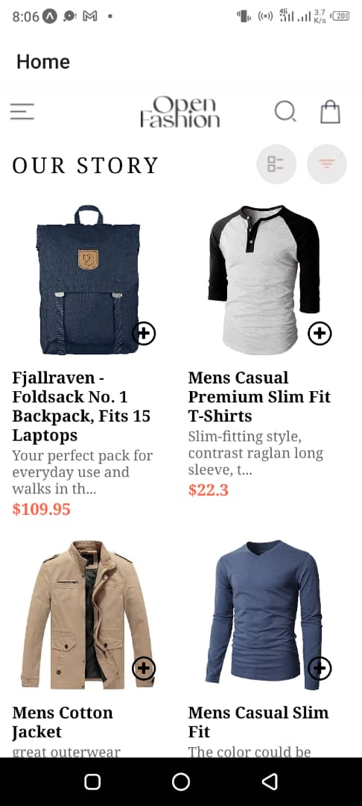
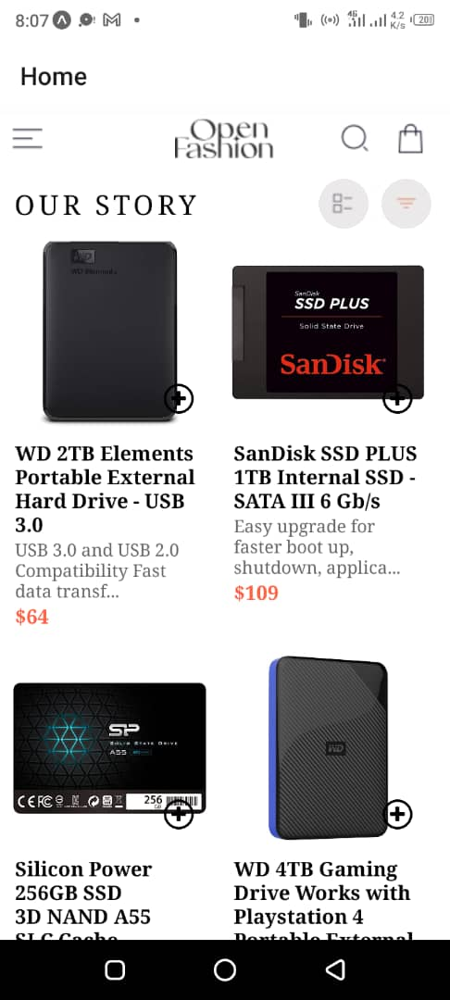
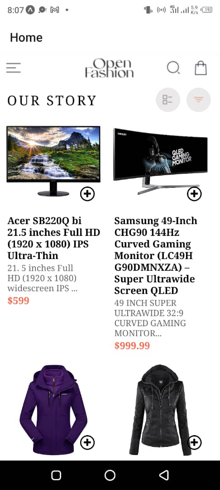
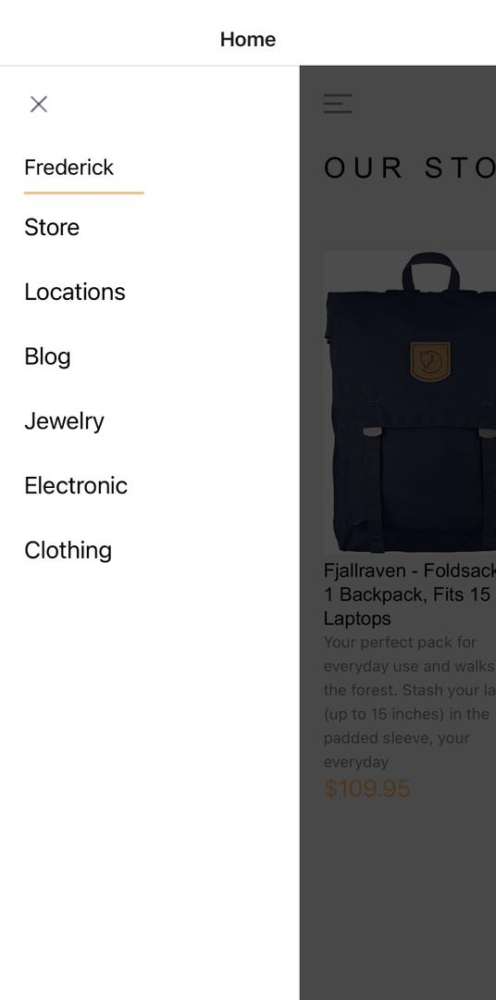
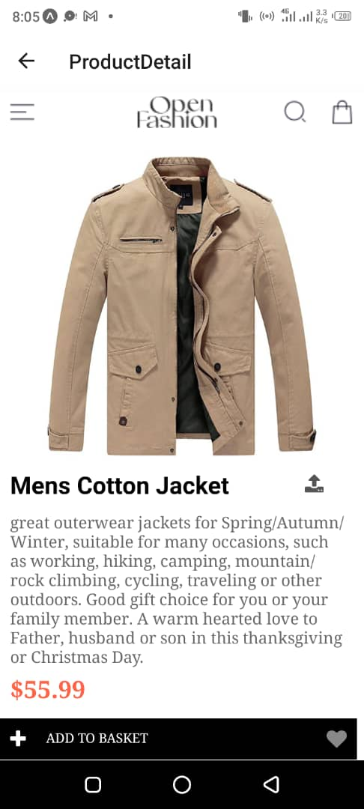
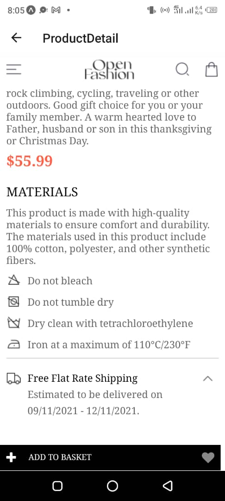
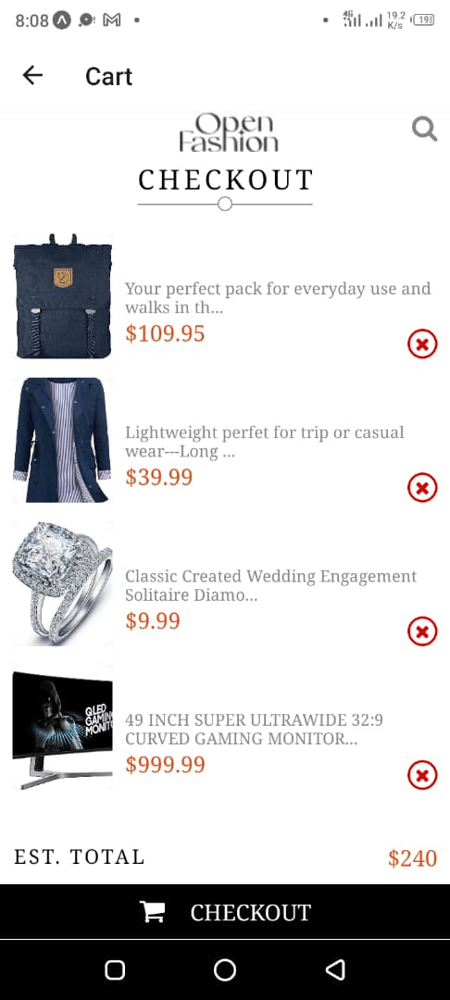

# React Native Shopping Application

## Project Overview
This React Native shopping application allows users to browse products, view detailed information about each product, add items to their cart, and manage their cart. The application fetches product data from an external API and uses local storage to save cart items on the user's device.

## Features
- Home screen displaying a list of products fetched from an external API
- Product detail screen with detailed information about each product
- Cart screen to view and manage cart items
- Drawer navigation for easy access to different screens
- Local storage for persisting cart items

## Design Choices

### User Interface
- **Home Screen**: Displays a list of products in a clean, scrollable view. Each product is represented by an image, name, and price.
- **Product Detail Screen**: Shows detailed information about the selected product, including an image, name, description, and price. Users can add the product to their cart from this screen.
- **Cart Screen**: Lists all items added to the cart with options to increase/decrease quantity or remove items.
- **Drawer Navigation**: Provides a user-friendly way to navigate between different screens, enhancing the overall user experience.

### Data Storage
- **Local Storage**: Implemented using `@react-native-async-storage/async-storage` to persist cart items. This ensures that users' cart data is retained even when the app is closed and reopened.

## Implementation Details

### Fetching Products
Product data is fetched from the [FakeStoreAPI](https://fakestoreapi.com/). Axios is used for making API requests. The data is then displayed on the Home Screen.

### Local Storage
Cart items are stored locally on the device using AsyncStorage. The following methods are used:
- **Add to Cart**: When a product is added to the cart, it's saved to AsyncStorage.
- **Remove from Cart**: When a product is removed from the cart, it's deleted from AsyncStorage.
- **Update Cart**: Any changes to the quantity of items in the cart are updated in AsyncStorage.

### Key Components
- **HomeScreen**: Displays the list of products.
- **ProductDetailScreen**: Displays detailed information about a selected product.
- **CartScreen**: Displays the list of items in the cart.
- **DrawerComponent**: Navigation drawer for accessing different screens.
- **APIService**: Service for handling API requests.

## Screenshots
### Home Screen





### Drawer Menu


### Product Detail Screen



### Cart Screen


## Getting Started

### Prerequisites
- Node.js
- npm or yarn
- React Native CLI or Expo CLI

### Installation
1. Clone the repository:
   ```sh
   git clone https://github.com/Bryan-Fred/rn-assignment7-11121058.git
   ```

2. Navigate to the project directory
    ```sh
    cd rn-assignment7-11121058
    ```

3. Install dependencies
    ```sh
    npm install #or
    yarn install
    ```

4. Run the project
    ```sh
    npm start
    ```